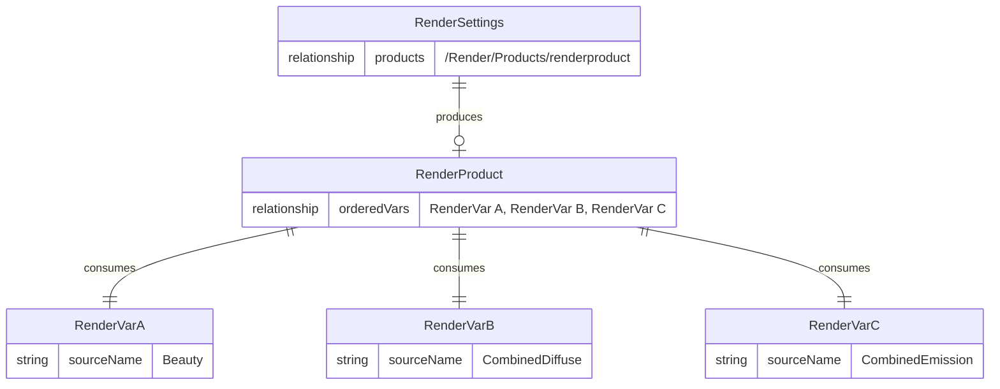
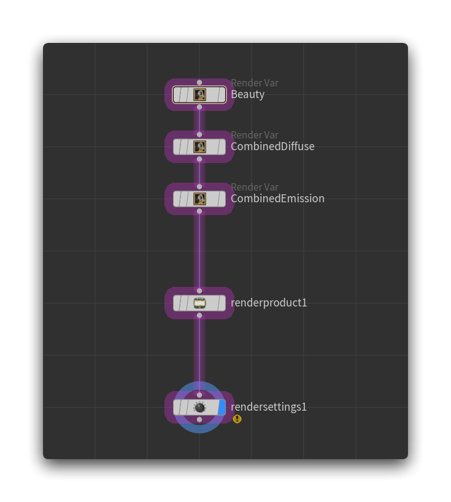

_How to use the [UsdRender](https://openusd.org/dev/api/usd_render_page_front.html) primitives in order to output an image._

## Relationship

In USD, all you need to render is a couple of primitives:
- RenderSettings
- RenderProduct
- RenderVar

Their relationship is described as:

Which translates this way into Houdini Solaris:

> [!warning]
> **Do not** forget to modify the parameter of each primitive: add the RenderVars through **Ordered Render Vars** inside the RenderProduct, then add the RenderProduct to the RenderSettings through the **Ordered Products** parameter.

> [!tip]
> As described in [[Render Globals#Variants]], you can **order** the RenderVars. Taking Arnold as an example, where the **Beauty** is called **RGBA**, you'll use `/Render/Products/Vars/RGBA /Render/Products/Vars/**` inside the RenderProduct **Ordered Render Vars** parameter to have **RGBA** prepended to the RenderVars list, so switching to the Arnold Hydra delegate will immediately show the right RenderVar.

