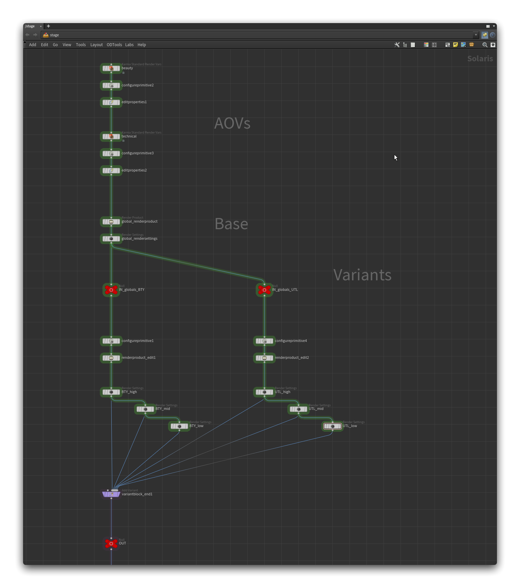
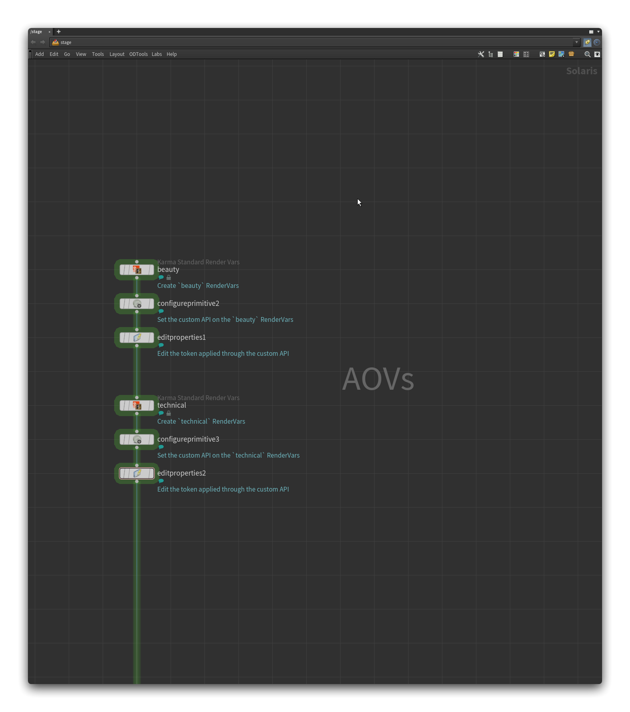
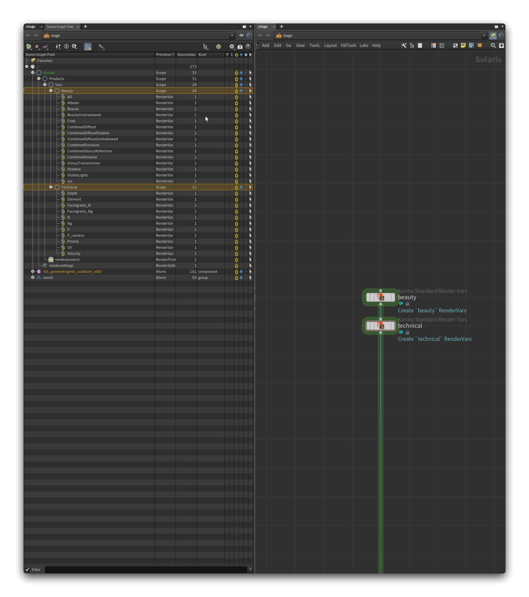
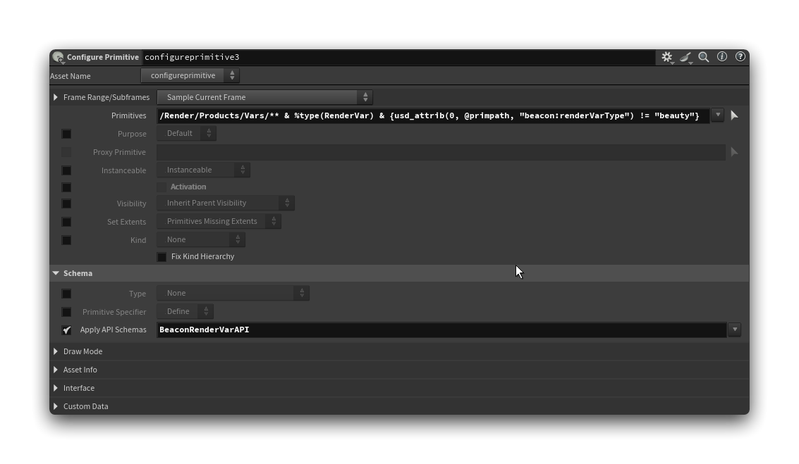
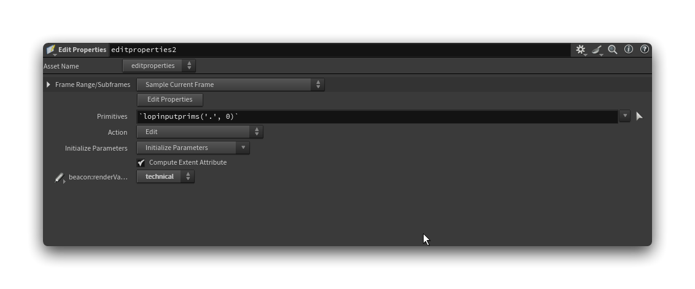
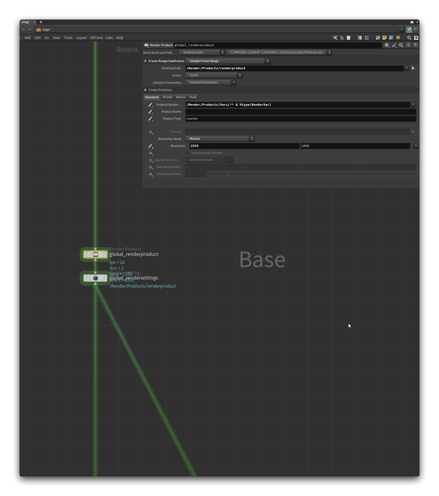
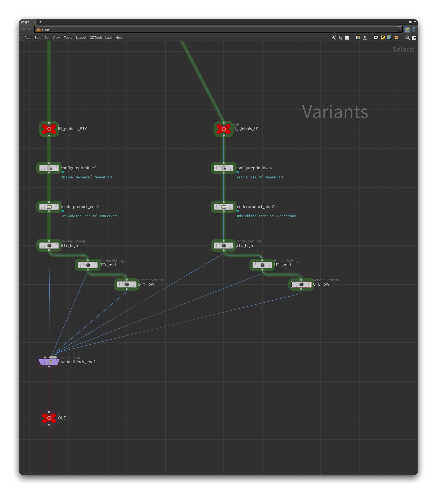
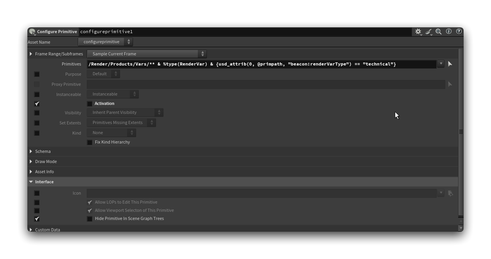
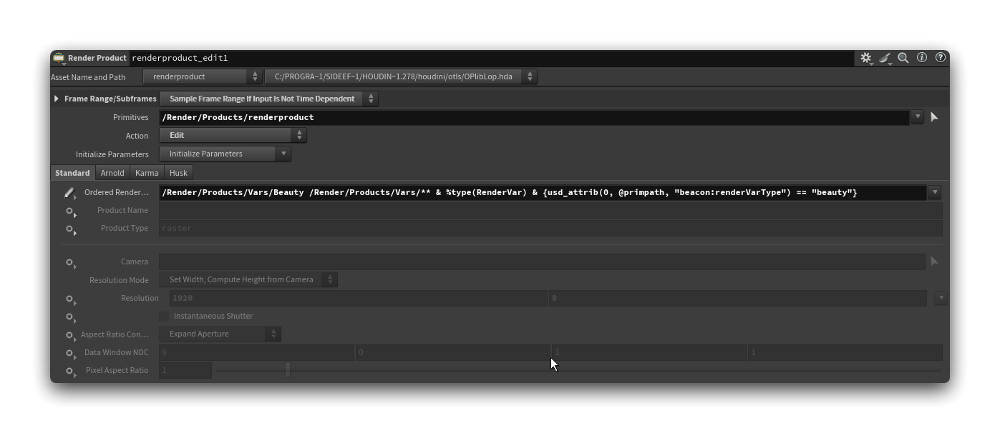

_How to create render globals in USD for use throughout a production._

## Goal

In a production environment, you might want to provide artists with a base of render settings they can use almost anywhere. In Solaris, we can leverage the USD variant system to author a set of variants applied on the `/Render` primitive to dictate which variant (preset) will be used.

> [!question] Why not appying it directly on the RenderSettings primitive?
> This allows us to control the linked RenderProducts and RenderVars easily.

Ideally, you would publish different global presets for specific pipeline steps: one for lookdev, one for lighting, etc.

> [!note]
> Even when publishing different globals for each pipeline step, they could still inherit from the same "master" global containing show resolution, aspect ratio, render engine, etc.

We could also have multiple RenderSettings pointing to multiple RenderProducts, but I prefer having a single standardized primitive that always resides in the same location — it simplifies things.

## Setup

In Solaris, the setup would look like this: 



You can see two "main" variant branches: **beauty** and **technical**. This is a personal production choice, where a technical pass contains the same renderable objects as the beauty pass but without lighting, a very low sample count, and what's defined as technical RenderVars: **depth**, **P**, **N**, etc. 
You could add many more, e.g. a branch for **environment**, another one for **characters**, etc.

Let's now dive deeper into each section of the above graph.

### RenderVars (AOVs)

Here's the RenderVars part of the setup, where we define our RenderVar primitives:



Each **Karma Standard Render Vars** node defines RenderVars for both the **beauty** and **technical** branches.

The trick is in the **Configure Primitive** and **Edit Properties** nodes: We select the newly created RenderVar primitives and apply a [custom API schema](../Plugins/Custom%20Schemas.md) to them. This adds a new set of attributes to the primitives, in my case a single `beacon:renderVarType` token, which can be set to **beauty**, **technical**, **light**, **crypto**, or **extra**.

> [!question] Why do we do this? 
> Adding an extra attribute to the RenderVar primitives allows you to group them neatly. In Houdini, you can then use a primitive pattern to select only the ones you want: `/Render/Products/Vars/** & %type(RenderVar) & {usd_attrib(0, @primpath, "beacon:renderVarType") == "beauty"}` will only iterate over the RenderVars you have defined as **beauty** RenderVars.

`schema.usda`

```C
class "BeaconRenderVarAPI" (
    customData = {
        string[] apiSchemaCanOnlyApplyTo = ["RenderVar"]
        string className = "RenderVarAPI"
    }
    inherits = </APISchemaBase>
)
{
    token beacon:renderVarType (
        doc = """Indicates the type of the RenderVar.

        - "beauty": Beauty AOVs, used to build the beauty pass back in a compositing software.
        - "technical":  Technical AOVs, usually used on utility passes.
        - "light":  AOVs generated through LPEs (Light Path Expression).
        - "crypto":  AOVs for CryptoMatte.
        - "extra": Additional debugging and miscelleanous AOVs.
        """
        allowedTokens = ["beauty", "technical", "light", "crypto", "extra"]
    )
}
```

> [!note]
> You don't need to add a custom API schema; a simple **Edit Properties** node where you add a token parameter will suffice. I created the API schema since it's faster to reuse and less prone to human error.

> [!tip] Alternative
> An even simpler way is to group the RenderVar primitives under a new Scope primitive for each "group". Note that this might require more work in the long run as some render engines expect RenderVars to be under `/Render/Product/Vars` by default. 
> I also find there are some benefits in having an attribute that can be read directly from the primitive rather than having to look for its parent.
> 
> 
> 
> If you're choosing that method, think about changing the primitive patterns in the [variants](#Variants) section of this guide.

Here are the node parameters for the **technical** side:





### Base

Now, define your main RenderProduct and RenderSettings:



Here, you define the main settings from which we'll branch out for our variants: resolution, samples, etc.

> [!note]
> Notice how we add all RenderVars to the RenderProduct? You can do this or not; it doesn't really matter since we'll refine the selection for each variant.

### Variants

Now we set up the variants for each render preset we want.



We'll work from the **beauty** (left on the above graph) branch.

Start with the **Configure Primitive** nodes: each node deactivates the RenderVars **we don't want** in a branch. This provides visual feedback when looking at the Scene Graph Tree, showing which ones will be added to the RenderProduct and which won't:



>[!tip]
> Deactivating primitives also allows you to filter them later using a primitive pattern: `/Render/Products/Vars/** & %type(RenderVar) & {usd_isactive(0, @primpath)}` will only iterate over activated RenderVar primitives.
> 
> It's also a good way to squeeze some performance as deactivated primitives are "off-limits" for the render engine.

> [!warning]
> If you used the alternative method in the [RenderVars (AOVs)](#RenderVars%20(AOVs)) section, the primitive pattern should be `/Render/Products/Vars/Technical/** & %type(RenderVar)`.

> [!note]
> You can also enable **Hide Primitive In Scene Graph** to hide them altogether.

Then, edit the RenderProduct primitive added in the [base](#Base) section with a **Render Product Edit** node, adding only the RenderProducts we want for the selected branch:


> [!warning]
> If you used the alternative method in the [RenderVars (AOVs)](#RenderVars%20(AOVs)) section, the primitive pattern should be `/Render/Products/Vars/Beauty/** & %type(RenderVar)`.

> [!tip]
> You'll notice some repetition in the primitive pattern: `/Render/Products/Vars/Beauty /Render/Products/Vars/**`. Since RenderVars are added alphabetically, you want **Beauty** to come first, not something like **Albedo** or **AO**. Otherwise, the Scene Viewer will show the wrong RenderVar first when switching to another Hydra delegate than Houdini GL (or VK).

Now, create your **Render Settings Edit** node and start editing the render engine settings based on the presets you want. In my setup, I have **BTY_high**, **BTY_mid**, and **BTY_low**. Each is connected to the previous one, but that's not mandatory: I'm doing it to easily divide the attribute values coming from the **high quality** variant into the lower quality ones.

Once you have your presets saved, plug them into the **Add Variant** second input, set the variant set and variant names, and voila!

## Final

If everything went well, the `/Render` primitive should now have several new variants (it should be green in the Scene Graph Tree).

To check that everything worked, drop a new **Set Variant** node and flick through your variants. Here's the **BTY_high** variant:


And the **UTL_high** variant:


Notice how the RenderVars primitives get disabled based on the variant choice? That's a good sign your variants are ready. You should also check your RenderSettings and RenderProduct attributes to ensure everything went well.

Once you're done, export the graph as a USD file and import it back as a Sublayer.

> [!tip]
> You might want to add the USD sublayer fairly high in the graph so you can edit its properties. If you use it in a shot environment, you may need to specify a camera using a **Render Settings Edit** node, which will need to point to an existing RenderSettings primitive.

> [!question] Primitive Patterns
> You might notice I'm using `**` in some primitive patterns throughout this guide, even though a simple `*` would suffice. This is a precaution in case an artist creates the RenderVars within another nested primitive under the `/Render/Products/Vars` primitive.
>
> This pattern isn’t resource-intensive, as only RenderVar primitives are expected to reside in that location.

---

> [!quote] Resources
> The asset used in the above screenshots is [Golden Knight](https://www.artstation.com/artwork/o2L6ZB) by [Francis Lamoureux](https://www.artstation.com/francislamoureux), downloaded from [Sketchfab](https://sketchfab.com/3d-models/golden-knight-06555f9ebaa640d8a50f356ffb67e8c9).
