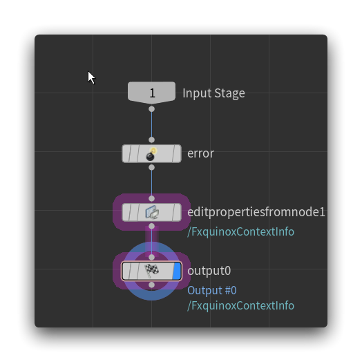

_How to integrate a custom USD schema like a native Houdini primitive node._

> [!note]
> You can find the **Fxquinox Context Info** HDA on [GitHub](https://github.com/healkeiser/fxquinox/blob/main/plugins/houdini/otls/lop_fxquinox.context_info.hda), or start from the **Fxquinox Primitive Template** HDA [there](https://github.com/healkeiser/fxquinox/blob/main/plugins/houdini/otls/lop_fxquinox.primitive_template.hda).

## Native Node

Let’s take a look at the native **Render Settings** primitive node:

![[../../../../_attachments/DViGtQ2cWB.png]]

It contains a couple of important elements:

- A **Frame Range Sampling** menu (useful to get rid of time dependencies)
- The **Primitive Path** parm (if in **Create** Mode)
- The **Primitives** parm (if in **Edit** mode)
- The **Action** menu, to either **Create** or **Edit** the primitive
- The **Initialize Parameters** menu, which lets you batch control the USD parms or retrieve another primitive attribute values (if in **Edit** mode)
- The **Create Primitives** menu, which allows you to control how and where the primitive will be created (if in **Create** mode)

> [!warning]
> The **Primitive Path** only appears in **Create** mode, whereas the **Primitives** one appears only in **Edit** mode. If you push your HDA and requires to use one or the other depending on the selected mode, you can create an invisible parm called `prim` and feed it a Python expression to retrieve the path(s) from the right parm according to the mode you chose.

## Custom Node (HDA)

In order to emulate all those, we can create an HDA with the following structure:

> [!tip]- Lock Primitive Path
>  Here, **Primitive Path** is a locked parameter: you might want to add an **OnCreated** callback to lock it (or simply make the parm invisible) in order to force artists to only use pipeline defined primitive paths.

![[../../../../_attachments/zHNp9aWjDm.png]]



### Internal Nodes

#### [Error](https://www.sidefx.com/docs/houdini/nodes/lop/error.html)

The [Error](https://www.sidefx.com/docs/houdini/nodes/lop/error.html) node contains the following code on the **Report this Error** parm:

``` python title="Error > enable"
node = hou.pwd()
node_parent = node.parent()
inputs = node.inputs()
if inputs and node_parent.evalParm("createprims") == 1:
    prim = node_parent.evalParm("primpath")
    stage = inputs[0].stage()
    return int(stage.GetPrimAtPath(prim).IsValid())
return 0
```

It will return this error to the user:

> An existing \`chs("hda_label")\` prim has been found at \`chs("../primpath")\`. You can only have one in your current scene. For selective edits, use a \`chs("hda_label")\` Edit instead.

if another primitive **with the same path** is found, and you’re about to override it by **creating** a new one **on the** **same path**.

`hda_label` is a spare parameter created on the **Error** node with a Python expression returning the value `Fxquinox Context Info`:

```python title="Error > HDA Label"
parent_node = hou.pwd().parent()
parent_type = parent_node.type()
parent_hda_definition = parent_type.definition()
author = parent_type.nameComponents()[1].title()
description = parent_hda_definition.description()
return f"{author} {description}"
```

> [!note]
> You can set the message verbosity (**error**, **warning**, **info**) directly onto the node. In this specific instance, we don’t want to allow the creation of multiple **Fxquinox Context Info** primitives, so it’s set on **error**, which will effectively set the HDA in an error-state and fail its cooking.
>
> For example, **Render Settings** just throws a warning when you're overriding an existing primitive.

> [!warning]
> Don't forget to add the error node path inside your HDA **Type Properties** > **Node**  > **Message Nodes** so the error gets displayed directly onto the HDA.

#### [Edit Properties from Node](https://www.sidefx.com/docs/houdini/nodes/lop/editpropertiesfromnode.html)

This node is where the magic happens. It’s pretty much the same as the [Edit Properties](https://www.sidefx.com/docs/houdini/nodes/lop/editproperties.html) node, with a nice change:

> [!quote]
> Instead of adding spare parameters to this node, you must direct it to another node from which it reads parameters that correspond to attributes on prims in the scene graph tree. When you edit these parameters on the other node, this node authors equivalent changes to the equivalent USD attributes.

That allows us to add the properties on the HDA itself: they will always be read from it and added accordingly.

This node is also linked to the **Frame Range Sampling** menu, **Primitive Path** parm, **Primitives** parm, **Action** menu, and the **Initialize Parameters** menu. It’s the one that allows our HDA to behave just like a native node. 

> [!tip]
> Basically, promote all parms of this node to your HDA except: **Parameters from Node**,  **Parameters**, **Prim Local**, **Prim Path Local**, **Prim Count Local**.

> [!note]
> You can simply drag and drop the [Edit Properties from Node](https://www.sidefx.com/docs/houdini/nodes/lop/editpropertiesfromnode.html) node onto the **Type Properties** window of your HDA to automatically promote **all** its parameters onto your HDA, then simply delete the ones you don't need.

> [!warning]
> Don't forget to add the [Edit Properties from Node](https://www.sidefx.com/docs/houdini/nodes/lop/editpropertiesfromnode.html) node path inside your HDA **Type Properties** > **Node**  > **Message Nodes** so an error gets displayed if the HDA is in **Edit** mode and it can't find the primitive to edit.
## Promote USD Attributes

In order for the [Edit Properties from Node](https://www.sidefx.com/docs/houdini/nodes/lop/editpropertiesfromnode.html) node to work, we need to bring the USD schema attributes to the HDA interface. With a custom schema, this gets very easy. Open the HDA **Type Properties**, and inside the **Parameters** tab navigate to the **From USD** tab. You can now filter the schema you want and add all its attributes to your parameters.

![[../../../../_attachments/ZksJ49B28q.png]]

They will be automatically read by the [Edit Properties from Node](https://www.sidefx.com/docs/houdini/nodes/lop/editpropertiesfromnode.html) node!

## Add an **Edit** Alias

On most of the native nodes creating a primitive, you’ll get two options: the node, and the node **edit**. Here's what gets displayed when pressing `TAB` inside the **Network View** to drop a **Render Settings** node:

![[../../../../_attachments/TLcLb9mGWC.png]]

You have the option to use a regular **Render Settings**, or a **Render Settings Edit**. Under the hood, this is a simple tool alias, which sets the **Action** menu to **Edit**, and sets all USD parameters to `none`, effectively **bypassing** any values that could have been added on the node parameters.

Here’s how it’s done for **Render Settings** (navigate to **Render Settings** > **Type Properties** > **Interactive** > **Shelf Tools**)

Inside the **Options** tab:

![[../../../../_attachments/houdini_0w1hgRxb5M.png]]

And inside the **Script** tab:

![[../../../../_attachments/houdini_ODFY580WFB.png]]

On our custom HDA **Type Properties** window, inside the **Interactive** > **Shelf Tools** tab, we can click on **Create New** and navigate to the **Options** tab. Copy-paste the values of the **Render Settings** > **Type Properties** > **Interactive** > **Shelf Tools** > **Options** tab.

For the **Script** tab, we need some adjustments:

``` python title="HDA > Type Properties > Interactive > Shelf Tools > Script"
import loptoolutils, loputils

node = loptoolutils.genericTool(kwargs, '$HDA_NAME', '$HDA_NAME'.split("::")[1] + '_edit1')
node.parm('createprims').set('off')
loputils.setAllControlParameters(node, 'none')
```

As you can see, we need to split the name: `$HDA_NAME` will return `fxquinox::contextinfo`, and `:` is an unauthorized character for a Houdini node name. We simply isolate the second name component, and add the `edit_1` part to it.

> [!note]
> This is only applicable if your HDA has an **author**, **branch** or **version** namespace.

This is what you should end up with inside the **Options** tab:

![[../../../../_attachments/houdini_Y3xCYIrgLk.png]]

And inside the **Script** tab:

![[../../../../_attachments/houdini_Lk1cldxtXE.png]]

You can now try to press `TAB` inside your **Network View** to drop the node, and should be welcomed by your HDA and its Edit variant:

![[../../../../_attachments/bhslDwCmk8.png]]

## Custom Icon

You can add an icon in the `$HOUDINI_PATH` following this naming convention: `SCENEGRAPH_primtype_<custom schema class>.svg`, to be displayed inside the Houdini **Scene Graph Tree** every time you apply your custom schema to a primitive:


In this case, the icon is `SCENEGRAPH_primtype_fxquinoxcontextinfo.svg`.
